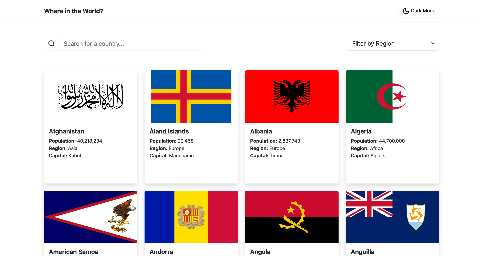

# REST Countries API with color theme switcher

This is a solution to the [REST Countries API with color theme switcher challenge on Frontend Mentor](https://www.frontendmentor.io/challenges/rest-countries-api-with-color-theme-switcher-5cacc469fec04111f7b848ca). 

## Overview


Users should be able to:

- See all countries from the [REST Countries API](https://restcountries.com) on the homepage
- Search for a country using an `input` field
- Filter countries by region
- Click on a country to see more detailed information on a separate page
- Click through to the border countries on the detail page
- Toggle the color scheme between light and dark mode

### Screenshot



- Live Site URL: [https://atmkcmo.github.io/where-in-the-world/](https://atmkcmo.github.io/where-in-the-world/)


### Built with

- Semantic HTML5 markup
- Sass
- Bootstap 5
- Vue3
- Vite.js
- Vue Router
- Flexbox
- Mobile-first workflow


### Project Setup

```sh
npm install
```

### Compile and Hot-Reload for Development

```sh
npm run dev
```

### Compile and Minify for Production

```sh
npm run build
```


## Author

- LinkedIn - [Adam McKee](https://www.linkedin.com/in/admckee/)